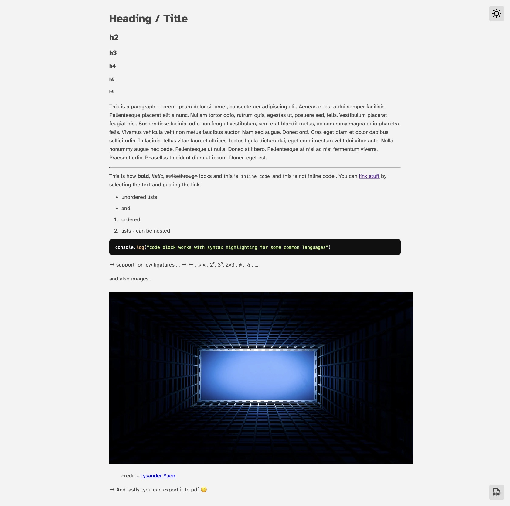

# Quill

Minimal web-based WYSIWYG Markdown editor built using Svelte and [tiptap](https://tiptap.dev)

## Features

-   uses most of the standard markdown shortcuts
-   can be exported to pdf

## Setup

Clone the project

```sh
git clone https://github.com/weasel-0/Quill.git
```

Install Dependencies

```sh
npm i
```

Start the project

```sh
npm run dev
```

<summary>Preview</summary>


